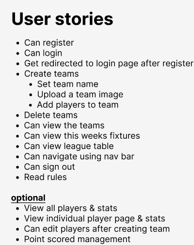
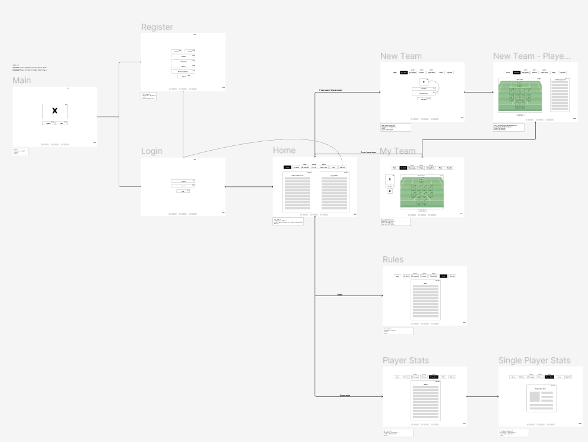
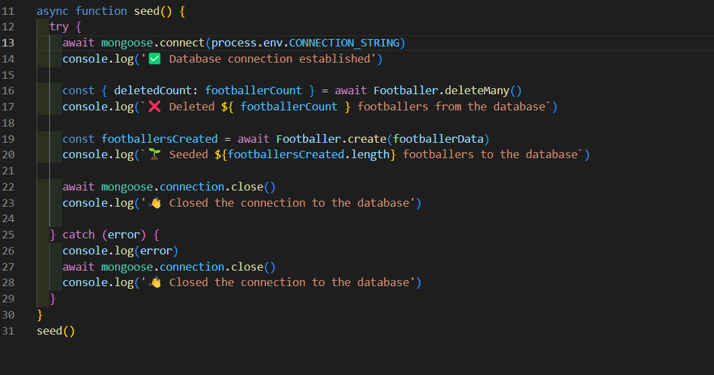
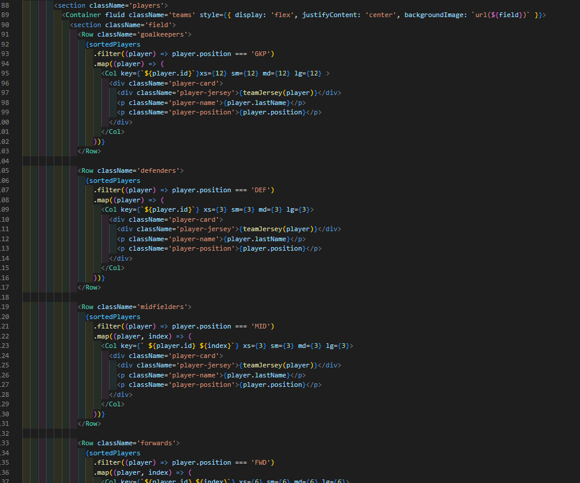
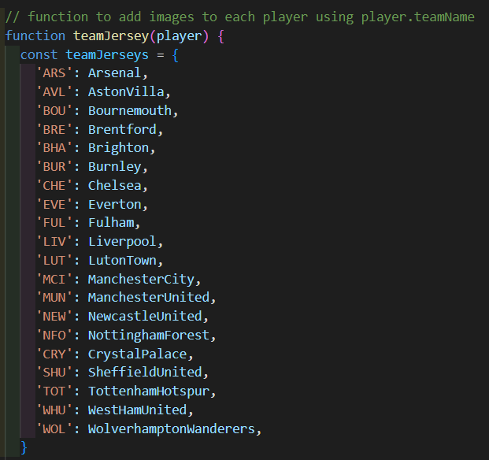

# Legends of the Turf ReadMe

## Overview and Concept

Legends of the Turf is a premier league fantasy football app developed as the third project at General Assembly. The app allows users to register, log in, create teams, delete teams, and update teams. Developed over the course of a week by a team of three, the project aimed to deliver a fully functional full-stack application with a visually impressive design.

Site’s Link: [Legends of the Turf](https://legends-of-the-turf-657a9862baae.herokuapp.com/)

## Technologies Used:

- **SCSS**
- **React**
- **JavaScript**
- **Insomnia**
- **Midjourney**
- **ChatGPT**
- **Figma**
- **Slack**
- **Google Spreadsheet**
- **MongoDB**
- **Cloudinary**

## Installation:

1. Clone the repository: `git clone git@github.com:Jerrellbb/legends-of-the-turf.git`
2. Navigate to the project directory: `cd client`
3. Install dependencies using your preferred package manager: `npm install`
4. Start the development server: `npm run dev`

## Technical Requirements:

Create a full-stack application with both backend and frontend components. Utilise an Express API to serve data from a MongoDB database and consume the API with a React-based frontend. The application should encompass multiple relationships, CRUD functionality for key models, and thoughtful user stories and wireframes. Prioritise a visually impressive design, allocating sufficient time for this aspect. Ensure the application is deployed online for public accessibility.

## Approach Taken

### Day 1:

- Brainstormed project ideas.
- Created User Stories and wireframes using Figma.
- Divided tasks among the team.

On day one, my team and I discussed various ideas we felt might have been a good choice for our project. Out of the few we came up with, we felt as a group that a fantasy football app was most unique. As a team we got started on figma first creating our User Stories.

Once we had the User Stories, we got started on our wireFrame to give us some direction with what we wanted.

We then used our group, we created on Slack to divide up the work we would get started on for day 2.

### Day 2:

The second day was dedicated to the server-side implementation. My responsibilities included creating models for Users, Teams, and Footballers, and establishing a comprehensive database of Premier League players using Google Sheets. The collected player information was then formatted into the MongoDB model using ChatGPT. This groundwork laid the foundation for the upcoming stages of the project

### Day 3:

Day three focused on developing and testing controllers for footballers and users. These controllers were pivotal in performing essential operations such as retrieving players, managing user profiles, and handling team-related functions. error handling was incorporated using try-catch blocks. Additionally, the controllers leverage Mongoose methods for seamless interaction with the MongoDB database. Additionally, a seed function was created to populate the database with footballers. Efforts were also directed towards user registration and login functionalities, solidifying the server-side functionalities of our fantasy football app.

### Day 4:

Transitioning to the client side, day four marked the initiation of our React-based front end.  My primary task was to develop the "My Team" component, employing React Bootstrap grid for a visually appealing 442 football formation.

 I also added an image of all the premier league team jerseys and created a function that displays the correct jersey depending on what the specific player's team is on within our database.

 

### Day 5:

On day five I took over from one of my teammates and finished off the register and log in page by creating the actions. Also implementing them which allows users to register and log in on our frontend. I then got started on the player selection component. I first started by adding the loader that gets all players from our database and displays them in a list on the page. You could then click on the players and it would add them to an array to update your team. At this point I passed it over to one of my teammates so I could focus on styling. I used Midjourney to create a background image for our landing page.

### Day 6:

Day six was marked by collaborative efforts to address challenges in image uploading to Cloudinary. Simultaneously, I started crafting a component showcasing Premier League team badges as links to their respective websites, adding a dynamic and informative touch to the application. As a team, we concentrated on refining overall styling, ensuring the app was ready for deployment by day's end. Discussions also ensued on the presentation strategy for the upcoming showcase on day seven, emphasising a polished and comprehensive final product.

## Key Learnings:

- Effective teamwork.
- Using Cloudinary for image uploading.
- Creating and using a MongoDB database.

## Wins:

- Efficient communication and task delegation among team members.

## Challenges:

- Implementing all desired functionalities within the time frame.

## Future Improvements:

- Implement drag-and-drop functionality for player selection.
- Add various formations other than the standard 442.

## Bugs:

- No known bugs from testing post-deployment.
